# How OED uses React/Redux/State/Props and the database in its pages

**This information is based on an older version of OED before React hooks and the Redux Toolkit. Thus, it no longer corresponds to what OED is likely doing.**

The following was originally written up in March 2022. The hope is that it will be kept up to date. If you think it can be improved then propose edits or let us know. It certainly is not complete or perfectly accurate but hopefully close.

The goal of this document is to describe how what you see on pages gets there. It is focused on the React and Redux parts of the system.

Note we just recently upgraded React-Redux to allow us to utilize useSelect(), etc. This has not happened and this document does not reflect that.

## Overview

OED uses names that correspond to standard React/Redux terminology (see [https://reactjs.org](https://reactjs.org), [https://redux.js.org/](https://redux.js.org/) and [https://react-redux.js.org](https://react-redux.js.org)). As such, the actions, components and reducers directories and files with related names all correspond to the related React/Redux items. mapStateToProps, MapDispatchToProps, connect and state are also standard items. The containers are where the mappings occur.

This begins with details on the meters page. It starts with an image of the files involved. Next it gives details on each file. This is followed by how to see the running code. Finally, it discusses how to see the state and actions involved in the running code. The next section discusses an example of how a change was made in the code to display all meters in a group. The final sections discuss other files (in less detail).

## Admin working on meters page

The page you go do depends on your login status. This assumes you are logged in as an admin so you go to the admin meters page. What follows starts from the admin meter page.

The following figure shows an overview of the files and methods used in showing the meter details page. Not all files are included. The figure uses the following color coding and symbols:

- Items in blue are client code under `src/client/app/`.
- Items in red are server code under `src/server/`.
- Green arrows show that one file is imported into another file. For example, MetersDetailsContainer imports MetersDetailComponent.
- Purple arrows show one function calling another or returning.
- The pink arrow is discussed below for looking at the code in the debugger.
- The letter label of the file name corresponds to the files discussed below.
- A black box inside another is a description, item or function.

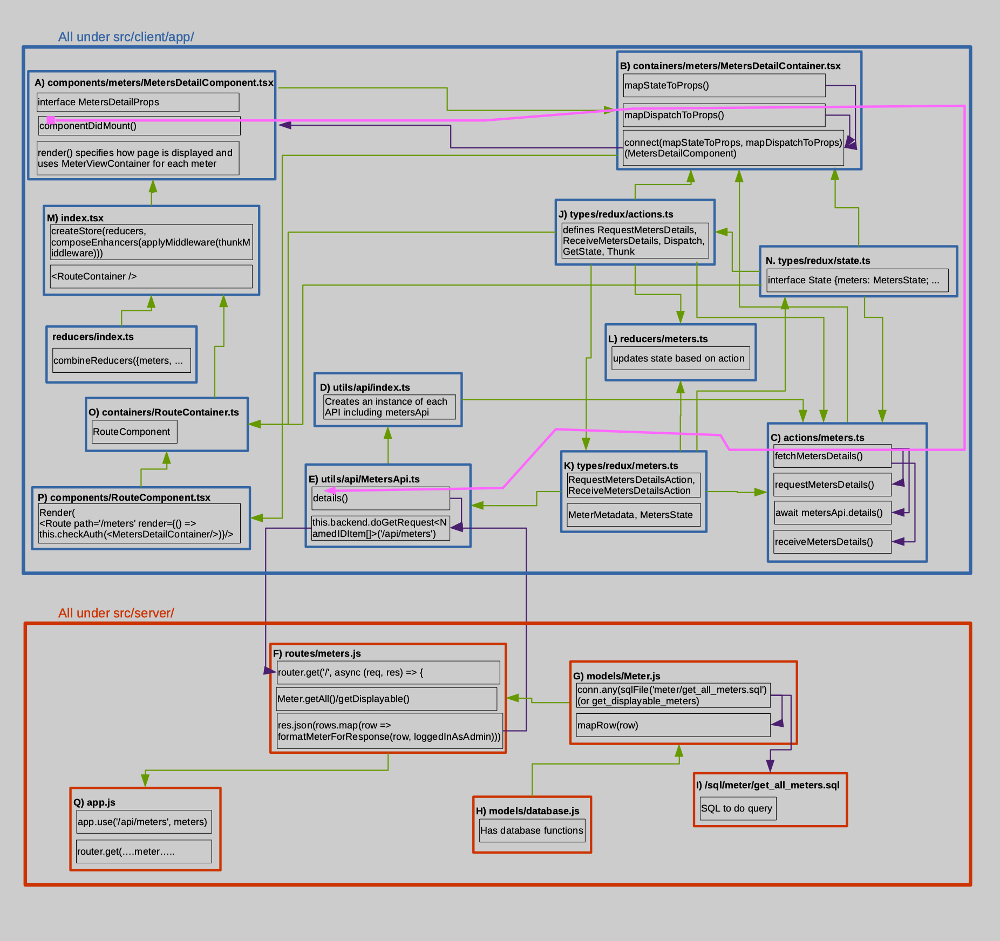

### The files used with admin meters page

This is moderately detailed information on what each file does. It is good to have the big picture before diving into this. It is followed by seeing what happens in the actual code.

- A) src/client/app/components/meters/MetersDetailComponent.tsx
  - This is what renders the page.
  - `export default class MetersDetailComponent extends React.Component<MetersDetailProps, {}> {`
    - The class name is the component name.
    - It `extends React.Component` is how it directly links to React.
    - The `MetersDetailProps` above defines the props associated with this component. The props are the information used on this page.
  - `interface MetersDetailProps {`
    - This is the definition of the props. There are two types:
      1. Data items with their type.
          - meters holds the meter ids that exist
          - loggedInAsAdmin specifies if the user is an admin since only admins can see certain meters
          - unsavedChanges specifies if something was edited but not yet changed. This is used to warning admins if they edit but do not save when trying to leave the page.
      2. Functions used to get needed information that will ultimately go to the server and database if needed.
          - `fetchMetersDetails()` gets information on meters
          - `submitEditedMeters()` starts the store of changes to the database
  - This also uses `src/client/app/containers/meters/MetersViewContainer.tsx`.
  - In the constructor, `this.handleSubmitClicked = this.handleSubmitClicked.bind(this);`
    - This attaches the function that will execute when you submit this page. Note that no changes are stored in the database until this happens.
  - `componentDidMount()` will be executed by React when this component is displayed. It allows actions to happen before the page is displayed.
    - `this.props.fetchMetersDetails()` causes the function to get meter details to fire up.
  - `render()` specifies what React should display on this page and the content is dynamic
    - The top is mostly styling.
    - The return is what is actually puts stuff on the page.
      - This component uses containers to specify the content (not all discussed)
        - `UnsavedWarningContainer` is how the code determines if there are unsaved changes.
        - `HeaderContainer` has the info and links at the top of the page.
        - `TooltipHelpContainerAlternative` creates many of the help icons. Note that this one takes a value parameter.
        - There is a Table with header where each row in the table will be one meter (see below).
        - The checks on `loggedInAsAdmin` are to make sure you are an admin in order to see certain information about a meter.
        - `FormattedMessage` is how strings are internationalized. The id is the key into src/client/app/translations/data.js where the value will be the string displayed depending on the chosen language.
        - `MeterViewContainer` links to the `MeterViewComponent` that holds information on each meter where the one being displayed is specified via parameters. Details on how are not given here (limited in section below) but are similar to other components and containers. `this.props.meters.map(meterID =>` causes each meter stored in the props array `meter` to be placed in its own `MeterViewContainer`.
        - There is a `Button` that controls saving the page where `onClick={this.handleSubmitClicked}` ties it to the function to do the actual work.
        - `FooterContainer` puts the info at the bottom of the page.
  - `removeUnsavedChanges()` causes a function to dispatch on the store (Redux state) that will get rid of all the changes entered on the page.
  - `handleSubmitClicked()` deals with saving page changes. First, it submits the props for saving and then are transferred to the database at this point. Second, it removes the changes since they have been dealt with using the previous function discussed.
- B) `src/client/app/containers/meters/MetersDetailContainer.tsx` (Each component has a related container and that is how to know to look at it.)
  - Every container has two important functions

    1. `mapStateToProps` tells how to take the state automatically passed as a parameter and map it onto the props used in the component. In this case it needs to do some work to get from the `state.currentUser.profile` to determine if they are an admin to set `loggedInAsAdmin`. For meters, it converts the keys that are a string into an integer where it ignores the ones that are not valid numbers. Finally, it looks to see if there are any editedMeters in the state to indicate there are unsaved changes. The function returns a value for each prop value expected in `MetersDetailProps` from `MetersDetailComponent`. Redux will automatically set the props based on the returned key/value pairs.
    2. `mapDispatchToProps` is what React/Redux uses when it wants to get new values. It will dispatch the functions as specified. Here it will both get meter details (`dispatch(fetchMetersDetails()`) and can submit edited meters (`dispatch(submitEditedMeters()`) but associated the function with the given name. This happens in `MetersDetailComponent` when `this.props.fetchMetersDetails()` or `this.props.submitEditedMeters()` is done.
  - A very important line is `export default connect(mapStateToProps, mapDispatchToProps)(MetersDetailComponent)`. The connect function links the two needed functions to the `MetersDetailComponent`. This is the React/Redux glue that lets the magic happen.
- C) `src/client/app/actions/meters.ts` is found from `mapDispatchToProps` function used in `MetersDetailContainer` and following the import for it at the top of that file.
  - Beginning with `fetchMetersDetails()`, this function gets the needed meter information as needed.
    - First it does `dispatch(requestMetersDetails())`. That function is in this file and it gets the action to do in this case (see below). This lets the overall system know it is getting this information.
    - Second, it does `const metersDetails = await metersApi.details()` and waits for it to finish. This is sent to the server to get meter info (see below). The `metersDetails` holds the information that is needed to set the state/props.
    - Finally, it does `dispatch(receiveMetersDetails(metersDetails)` which is similar to the first item but tells the system that the data has been received. At this point React/Redux knows it has the needed information and can set the props and render the page update.
- D) `src/client/app/utils/api/index.ts` is from following the definition of `metersApi.details()`. It creates the Api items.
- E) The definition of MetersAPI is followed to `src/client/app/utils/api/MetersApi.ts`. The `details()` method is there which was called in `meters.js`. It does `return await this.backend.doGetRequest<NamedIDItem[]>('/api/meters')`. (The origin of `doGetRequest` is in `src/client/app/utils/api/ApiBackend.ts` but this will not be pursued.) As the name implies, this is going to do a backend/server request. As such, this is the last code in src/client/app before going to src/server.
- F) The line above goes to `src/server/routes/meters.js` (yes, another meter.js/ts file). The `/api/meters` above indicates it is in the meter route and it will use the highest level route (nothing after meters). Thus, this is handled by `router.get('/', async (req, res) => {`.
  - First it gets a database connection as usual.
  - Next it determines if this is coming from an admin to determine which get of meter data to do.
  - If it is an admin it does `Meter.getAll` and, if not, it does `Meter.getDisplayable` by setting the query variable and then doing `const rows = await query(conn);`.
  - Finally it sends back the result via json by `res.json(rows.map(row => formatMeterForResponse(row, loggedInAsAdmin)));`. The `formatMeterForResponse` above defines what can be returned and only shows some items if an admim (these are null when `formattedMeter` is defined but the others are set to values). There is also the error clause in case something went wrong in getting the meter values.
- G) Following the Meter.getXXX call goes to `src/server/models/Meter.js`. This is the model that gives JavaScript calls that execute database queries to get desired information. Lets look at getAll (getDisplayable is similar).
  - It does `const rows = await conn.any(sqlFile('meter/get_all_meters.sql'));`. Using the passed database connection, conn.any means the query can return any number of rows (0, 1, many). This comes from the PG Promise (pgp) package that OED uses.
  - The `rows` result is mapped using `Meter.mapRow`, located above, which takes a row from the database result and creates an instance of the Meter class. Abstracting this allows all calls to use this and means changes to the database can generally be limited to this one function. This shows that the function returns an array of Meter objects.
- H) `sqlFile` leads to `src/server/models/database.js`. It creates the path to all the SQL files used (`/src/server/sql`) and forms the needed pgp query.
- I) The SQL is found in `src/server/sql/meter/get_all_meters.sql` that does basic SQL to get all the meters with all attributes.

- J) `src/client/app/types/redux/actions.ts` is found by following the import for `ActionType`, `Dispatch`, etc. from meters.ts or import in `src/client/app/containers/meters/MetersDetailContainer.tsx`.
  - At the bottom of this file, `Dispatch`, `GetState` and `Thunk` are defined for use in actions/*.ts files and was used in `src/client/app/actions/meters.ts`.
  - Looking at `RequestMetersDetails` since it was discussed just above, it defines the string `'REQUEST_METERS_DETAILS'`. `receiveMetersDetails` is similar.
- K) `requestMetersDetails` in `meters.ts` is of type `t.RequestMetersDetailsAction` so following the import for `t` takes us to `src/client/app/types/redux/meters.ts` (a different meters.ts file than above). This gives the interface for the meter actions along with defining the Metadata that is used for these. Also, as seen from the import in a number of files, `src/client/app/types/redux/state.ts` has the definition of the state that OED uses. In the case of meters, it has `meters: MetersState` that leads to `src/client/app/types/redux/meters.ts`. This shows that this part of the state has `isFetching`, `byMeterID`, `selectedMeters`, `editedMeters` and `submitting`. What each does can be tracked down by following it in the code. For example, the details on each meter will be listed under `byMeterID` where each entry is by meter ID (from `MeterMetadataByID`) and has everything in `MeterMetadata`. Others are discussed elsewhere. This can be seen in the Redux developer tool in the web browser.

- L) `src/client/app/reducers/meters.ts` is a standard Redux reducer that that tells how to update the state based on which action was taken. Note that it should return a new object. Redux state should be treated as immutable. For example, `RequestMetersDetails` updates the state so `isFetching` is true. `ReceiveMetersDetails` sets `isFetching` to show it is not doing that and also sets the meter information in `byMeterID`.

### Redux store

The Redux store is created by:

- M) `src/client/app/index.tsx`
  - `const store = createStore(reducers, composeEnhancers(applyMiddleware(thunkMiddleware)));` creates the store.
    - `reducers` lets the system know the reducer information is in `src/client/app/reducers/index.ts`. This leads to the actual reducers for the different items (e.g., as was seen for meters).
  - `store.dispatch<any>(initScript())` initializes the store with information that OED knows it will need right away.
    - This leads to `src/client/app/initScript.ts` that gets the current user.
  - `<Provider store={store}>` gives the store to this element and all its child components.
- N) `src/client/app/types/redux/state.ts` is used in `src/client/app/actions/meters.ts`, `src/client/app/containers/meters/MetersDetailContainer.tsx` and `src/client/app/types/redux/actions.ts`. The `MetersState` is defined `src/client/app/types/redux/meters.ts.`

### Routes

OED uses Express to do its routes. They are created as follows:

- M) `src/client/app/index.tsx` has `<RouteContainer />` that adds the needed element.
- O) This leads to `src/client/app/containers/RouteContainer.ts` that is a classic React/Redux element that connects to `RouteComponent`.
- P) This leads to `src/client/app/components/RouteComponent.tsx`.
  - The `render()` function has a number of `<Route ...>` elements. For example, it has `<Route path='/meters' render={() => this.checkAuth(<MetersDetailContainer/>)}/>`
    - This makes requests such as `localhost:3000/meters` go to the `MetersDetailContainer` container.
    - It also does a `checkAuth` to determine the type of user so it knows what to display (different for admin vs other users).
      - The `requireAuth` means that only an admin can get there.
  - `linkToGraph()` is middleware to get the chart links that OED provides by making sure they are kept up to date with each route.
  - `RouteProps` are the props associated with this component and is information that is global in nature.
- Q) `src/server/app.js` has the actual routes used.
  - The router is created with `const router = express.Router();`.
  - There are many lines similar to `app.use('/api/meters', meters);`. This is why having `/meters` at the end of the URL goes to `src/server/routes/meters.js` given the `require` for meters.
  - The `router.get(/^(\/)(login|admin|groups|createGroup|editGroup|graph|meters|editMeter|maps|calibration|users|csv)?$/, (req, res) => {` is also crucial. If you add a new route, it be in this list.
    - There items listed that are in `RouteComponent` but not above with `app.use`
      - TODO Why is calibration, etc. only here and not above?

### MeterView

- `src/client/app/components/meters/MetersViewComponent.tsx` is very similar to `MetersDetailComponent` except it also uses `src/client/app/types/redux/meters.ts` and `src/client/app/actions/meters.ts`.
- `src/client/app/components/meters/MetersViewContainer.tsx` is very similar to `MetersDetailContainer` expect it also uses `src/client/app/types/redux/meters.ts`.

## Seeing meter code in action

This section demonstrates how you can see the code while it is running.

- Do in the web browser developer tools (the following images are from Firefox but others should work). First, log in as admin so can get to the meter details page.
- Begin by opening the last file called on the server, e.g., `src/client/app/utils/api/MetersApi.ts`

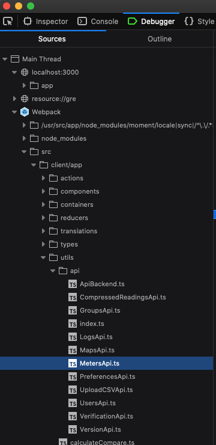

- Put a breakpoint in the details() method that calls the server code:

- In the web browser, go to the meters page as an admin. It should activate the breakpoint just set. Look at the call stack that is active (click to "Expand rows" to see the entire stack):

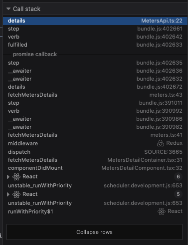

- The first item is the line where you put the breakpoint in MetersApi.ts on line 22 at the details() function call. It should already have been displayed but you can click on this line to get to it at any time.
  - You can see the directory the file comes from on the left. If it is hard to tell the exact file, right-click the file tab and choose "Reveal in tree" to fully open the path on the left. (You can also do "Copy source URI" and then paste to see the location.):

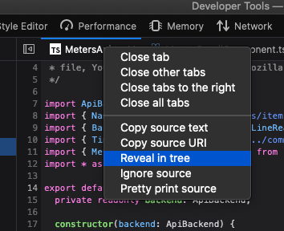

- Click the next item in the call stack that is OED code, e.g., fetchMetersDetails in meters.ts on line 43. This will open that file. The item clicked in the call stack is highlighted in black and the line in the file that opens is briefly highlighted in gold. In this case the file is `actions/meters.ts` on line 43 that did `await metersApi.details()` call:

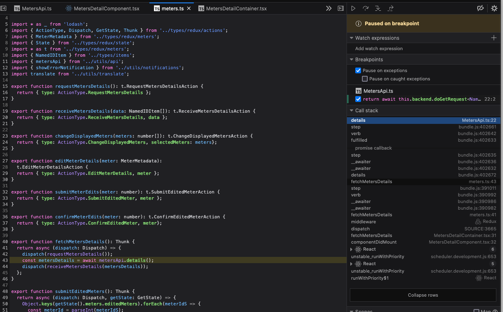

- If you do the next one on the call stack you go to the same file on line 41. This did the dispatch of the calls that include `requestMetersDetails()` and `receiveMetersDetails(metersDetails)` along with the call the `metersApi.details()`. The next item back in the call stack is in `containers/meters/MetersDetailContainer.tsx` on line 31 that does the `dispatch(fetchMetersDetails())` call:

- If you go another step back in the call stack you get to `components/meters/MetersDetailComponent.tsx` on line 32 that is in `componentDidMount()` doing `this.props.fetchMetersDetails()`:

- The rest of the calls are not OED code. The calls from the stack are shown in the overview figure of the meters code by the pink curve. As can be seen, the non-React parts were touched, except for OED code that sets up items.

- It is tricky in the web browser debugger to see all the code and call stack of interest. Part of the issue is that the React-Redux system automatically dispatches code. Another part is that starting with the first call and trying to step into code leads to a lot of React-Redux code. OED continues to work on making debugging easier and we welcome input from developers that figure out easier ways. Most of the items not on the pink path are ones that define interfaces, functions, etc. so are not directly executed. One that is not is `reducers/meters.ts` that has cases for `ActionType.RequestMetersDetails` and `ReceiveMetersDetails`. Put breakpoints on the return within these two cases and go to the meters page. (Note you may need to refresh the web page to force it to both request and then receive the meter details. For unknown reasons, the pages may not respond after doing this.) The code will stop on the call to `RequestMetersDetails`. The following figure shows the code, the call stack with similar calls to before and shows the value of the `state` variable. The `state` shows that it has yet to start the `RequestMetersDetails` (`isFetching` is false) and there is no info in `byMeterID`.

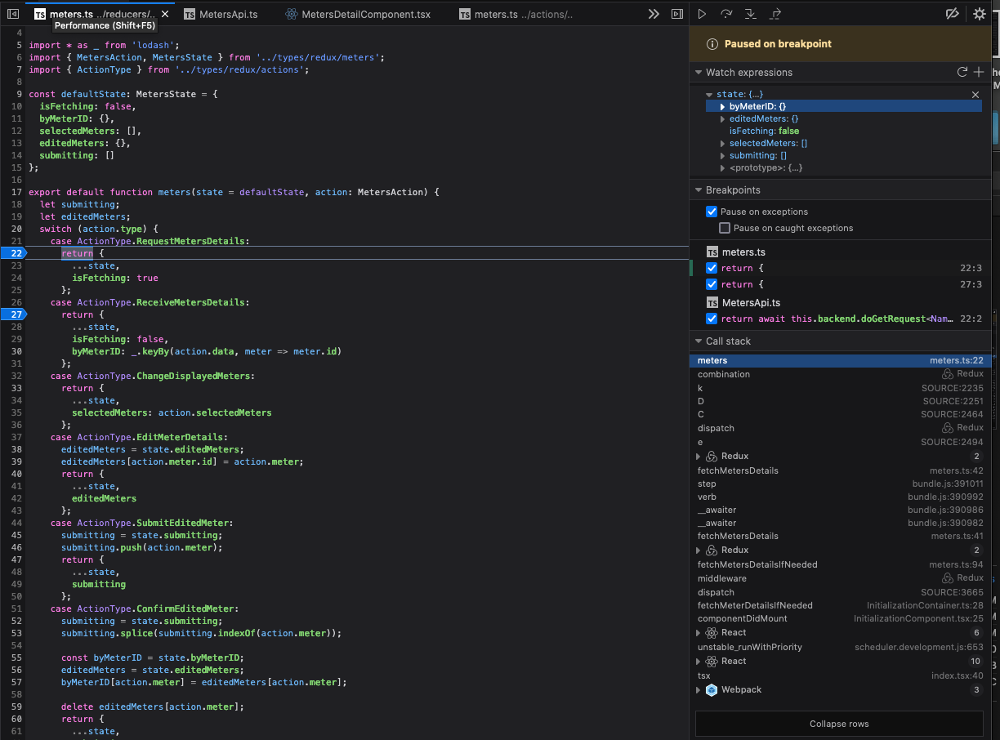

If the code is allowed to continue, it will stop in `ReceiveMetersDetails` as shown in the next figure. Just as the receive is about to happen, the `isFetching` is true but `byMeterID` in state has not been set.

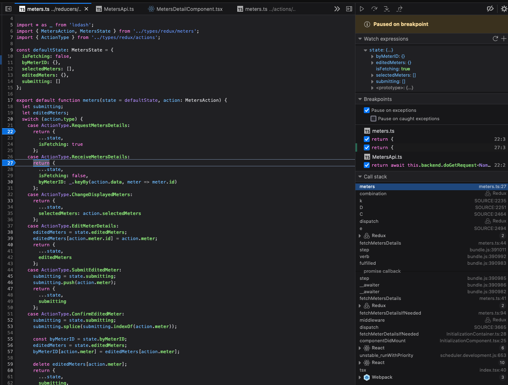

If you let the code continue, it will again stop at `ReceiveMetersDetails`. This time `isFetching` is false and `byMeterID` in `state` now has data.

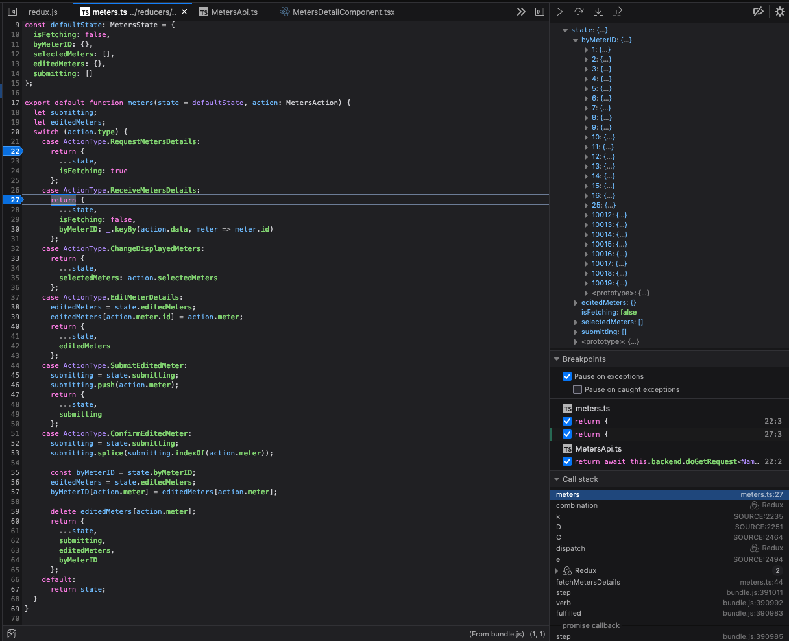

Hopefully this helps show how the meters details page work.

Now lets look at the action and states. After you load the meter page, click on the redux tools/tab (assumes you have them installed in the web browser). Click on the first REQUEST_METERS_DETAILS action on the far left and the Action tab on the top, right as shown in the figure below. It shows the action as expected.

Now click the Diff tab and you will see the that this action caused the isFetching to become true:

Now click on the State tab to see this action inside the full state:

Finally, click on the Trace tab to see the code that caused this action (this assumes you have turned on tracing; directions are on the Developer Details help page):

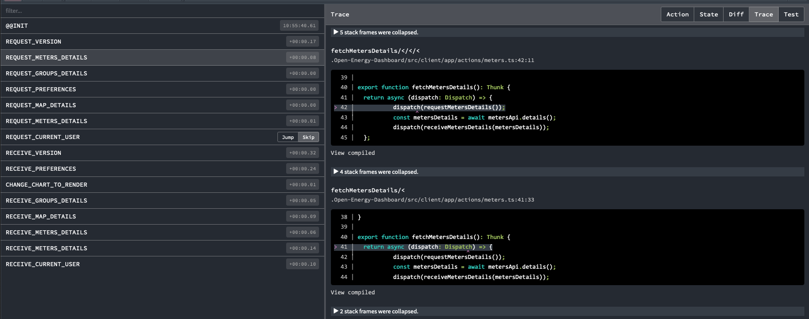

Now click on the first RECEIVE_METERS_DETAILS on the left and the Action tab. Note you can also see the data that was received:

Now click on the Diff tab to see that isFetching became false and the byMeterID holds the data seen in the action:

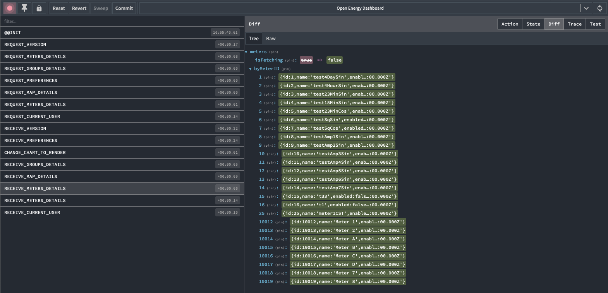

Now click on the State tab to see this action inside the full state:

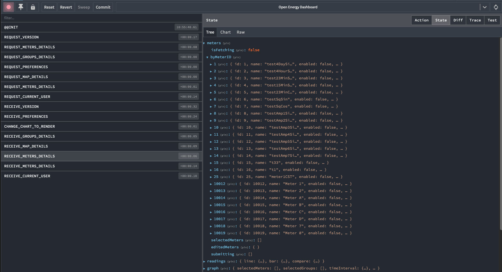

Now click on the Trace tab to see the code that caused this action:

Note that when viewing state you can visualize it as a Tree (what was shown), Chart and Raw. These different views can help see the state in different way.

## How to create a new page/route

This shows the changes that were made in order to add all the child meters to the group viewing page. The new state/prop involved is named deepMeters and is an array of strings but note that the information passed back from the database are the IDs that must then be converted into the names. The order is somewhat similar to following the pink arrow backward but this is for a group page instead of a meter page. It also starts in the server side and does not skip over some of the redux boxes. The changes were:

- `src/server/routes/groups.js`
  - This route must now return the `deepMeters` by changing the code in:  
  `router.get('/children/:group_id', async (req, res) => {`  
  to get that data from `getDeepMetersByGroupID` and then return it via `res.json`:  
  `const [meters, groups, deepMeters] = await Promise.all([`  
  `  Group.getImmediateMetersByGroupID(req.params.group_id, conn),`  
  `  Group.getImmediateGroupsByGroupID(req.params.group_id, conn),`  
  `  Group.getDeepMetersByGroupID(req.params.group_id, conn)`  
  `]);`  
  `res.json({ meters, groups, deepMeters });`
- `src/client/app/utils/api/GroupsApi.ts`
  - The request for data from the model and database on the server must now get the desired deep meters:  
  `public async children(groupID: number): Promise<{meters: number[], groups: number[], deepMeters: number[]}> {`  
  `  return await this.backend.doGetRequest<{meters: number[], groups: number[], deepMeters: number[]}>(`api/groups/children/${groupID}`);`  
  `}`  
  where each line had the item on `deepMeters` added.
- `src/client/app/types/redux/groups.ts`
  - The `interface ReceiveGroupChildrenAction` must be updated for the new data it receives:  
  `data: {meters: number[], groups: number[], deepMeters: number[]}`  
  where `, deepMeters: number[]` was added for the new meters that are needed. Note this is an array of numbers because the database returns the IDs.
  - Different group actions return different sets of data. To deal with this, there are interfaces that are then combined. First, a new interface is created:  
  `export interface GroupDeepMeters { deepMeters: number[]; }`  
  and this is added to the combined type that already existed:  
  `export type GroupDefinition = GroupData & GroupMetadata & GroupID & GroupDeepMeters;`
- `src/client/app/reducers/groups.ts`
  - The `case ActionType.ReceiveGroupsDetails:` needs to set the `deepMeters` to an empty array:  
  `deepMeters: []`  
  This is necessary so that the array exists when the action to get the deep meters happens. This works because the `ReceiveGroupsDetails` action always happens before the `receiveGroupChildren` that gets the deep meters. If you don't do this then when the `receiveGroupChildren` happens initially and returns no `deepMeters` then you get an error because the array does not exist. In the ideal world this would not happen but it does.
  - The `case ActionType.ReceiveGroupChildren:` needs to add the deep meters to the state:  
  `...state.byGroupID[action.groupID],`  
  `  isFetching: false,`  
  `  outdated: false,`  
  `  childGroups: action.data.groups,`  
  `  childMeters: action.data.meters,`  
  `  deepMeters: action.data.deepMeters`  
  In this case we don't need to add a new action because we are reusing the `ReceiveGroupChildren` that is happening to get the immediate meters and groups. Since whenever we display those we want to show the deep meters it is okay to do this. Note `isFetching: false` was already there and notes the item has been received. The added line is the last one to set the `deepMeters` in the state.
- `src/client/app/actions/groups.ts`
  - `function receiveGroupChildren(groupID: number, data: {meters: number[], groups: number[]}): t.ReceiveGroupChildrenAction {`  
  becomes  
  `function receiveGroupChildren(groupID: number, data: {meters: number[], groups: number[], deepMeters: number[]}): t.ReceiveGroupChildrenAction {`  
  which adds the new information that is gotten by the `receiveGroupChildren` action.
- `src/client/app/containers/groups/GroupViewContainer.ts`
  - The function `mapStateToProps` needs to set the prop for the meter names:  
  `const deepMeterNames = state.groups.byGroupID[id].deepMeters.map((meterID: number) => state.meters.byMeterID[meterID].name.trim()).sort();`  
  Note this takes the state holding the IDs for the desired meters (`state.groups.byGroupID[id].deepMeters`) and maps them to the names where the `trim()` removes any extra spaces and the `sort()` puts them in alphabetical order, as desired. And finally the returned values from the function needs to have `deepMeterNames` added.
- `src/client/app/components/groups/GroupViewComponent.tsx`
  - Add the new prop info by changing `interface GroupViewProps` to include `deepMeterNames: string[];`
  - Inside the `render()` function, add the new information on the children by first putting a header:  
    `<FormattedMessage id='group.all.meters' />`  
    Note the actual text is internationalized (see below). If it is not straight text then there are other ways to internationalize the string that can be found in the codebase. All strings should be internationalized.  
    The list of meters is placed next (not all the formatting of the page is shown):  
    `<ListDisplayComponent items={this.props.deepMeterNames}`
- `src/client/app/translations/data.js`
  - The translations need to be added. This file has a section for each language where they are identified by their i18n standard two character identifiers. At the current time we have 'en' (English), 'fr' (French) and 'es' (Spanish). Each new internationalized string needs to go in each language section with the same key. In this case we named the key `group.all.meters` because the user thinks of these as all the meters in the group. It begins with `group.` because it is part of the strings associated with groups. In the 'en' section it has  
  `"group.all.meters": "All Meters",`  
  and the 'fr' section has  
  `"group.all.meters": "(Need French) All Meters",`  
  and the 'es' section has  
  `"group.all.meters": "(Need Spanish) All Meters",`  
  The last two show what developers do when they cannot translate the string. They put the English phrase prefixed by the need to translate.

Note that if you were creating a new page then you would need to create the container and component files. If you wanted to use a new action then you need to add it to `types/redux/actions.ts` and `client/app/types/redux/<item>.ts` where `<item>` might be groups or whatever you are working on. If you have new state you will change `/client/app/types/redux/state.ts`. It is possible you will need to edit other files as well.

## Other pages

This is limited information about some other pages.

### Create admin users

The main page is at `src/client/app/containers/admin/CreateUserContainer.tsx`. Unlike meter details, it has its own state. The information on users is not kept in Redux state so there are not the map type functions in this case. The state is held until the new user is submitted and then transferred to the database.

### Create map

This is different since it must go through several stages/pages to create a new map including upload and calibration. There is `maps:editedMaps` in `state` that store information during this process where the ids are negative. (When an existing map is edited the actual id is used.)

### Groups

These pages have actions for each item that can be entered for a group. Thus, React-Redux is working as each item or character is entered and displaying the result. This may have been done since menus are modified as meters and groups are entered or it may be the developers preferred a solution completely integrated with React-Redux. Whatever the reason, there are many more actions to deal with.

### Looking at putting the version on the footer

This is an older discussion of the process of putting the version on the footer of the page. It differs because it is placed on the main page so the files start at a higher point in the chain and it traces all the components/containers that are used. It has not been updated as recently.

#### Version files used

1. src/client/app/index.tsx
    - renders the app, creates the store using RouteContainer
2. src/client/app/containers/RouteContainer.ts
    - has mapStateToProps, mapDispatchToProps and connects them to RouteComponent
3. src/client/app/components/RouteComponent.tsx
    - has render() for routes that has a div with routes including HomeComponent
    - Has several other functions including hot linking switch stmt
    - It has InitializationContainer that will involve dispatching lots of needed state
4. src/client/app/components/HomeComponent.tsx
    - has div to put together TooltipHelpComponent, HeaderContainer, DashboardContainer, FooterContainer.
5. src/client/app/containers/FooterContainer.ts
    - has mapStateToProps that sets version from state.version.version
    - mapDispatchToProps that creates function to dispatch fetchVersionIfNeeded
    - export connects these two to FooterComponent
6. src/client/app/components/FooterComponent.tsx
    - Is a class with props constructor
    - has render that accesses this.props.version
    - puts the version on the page in the footer
7. src/client/app/actions/version.ts
    - return requestVersion(), receiveVersion()
        - involves ActionType
    - return boolean: shouldFetchVersion()
    - return Thunk: fetchVersion() & fetchVersionIFNeeded()
8. src/client/app/types/redux/actions.ts
    - defines all the action types including ones used by version.ts
9. src/client/app/types/redux/state.ts
    - holds the State definition including version: VersionState
10. src/client/app/types/redux/version.ts
    - holds the interface for RequestVersion, ReceiveVersion
    - holds type of VersionAction
    - holds interface for VersionState
11. src/client/app/utils/api/index.ts (from going back to src/client/app/actions/version.ts and following versionApi)
    - holds the definition of versionApi used in version.ts that uses VersionAPI
12. src/client/app/utils/api/VersionApi.ts
    - A class that does a request to get the version via /api/version using a ApiBackend instance.
13. src/client/app/utils/api/ApiBackend.ts
    - defines the methods to Post, Get, Put Requests
    - this is a general definition and not specific to Footer.
14. src/server/routes/version.js (just know used and first code on server)
    - the route to deal with the /api/version request from VersionApi.ts
    - calls src/server/version.js to get the actual version
15. src/server/version.js
    - Has code that parses the package.json string for version to get the actual version.

src/client/app/containers/InitializationContainer.ts dispatches to get lots of needed state.

#### To see this in action

1. Follow the directions in [Dev details, Seeing what is happening with OED in bullet on traces](https://openenergydashboard.org/developer/devDetails/#goingOn) to edit src/client/app/index.tsx to enable traces.
2. In web browser go to developer tools (Firefox: Tools->Browser Tools->Web Browser Tools; Chrome View->Developer->Developer Tools). I prefer the info in a separate window so click the three vertical (Chrome) or horizontal (Firefox) dots on the upper, right side->Dock side and click for undock into separate window) and then reload page. Click on Redux tools icon and then Trace tab. Click on the REQUEST_VERSION action and the window will look something similar to this:

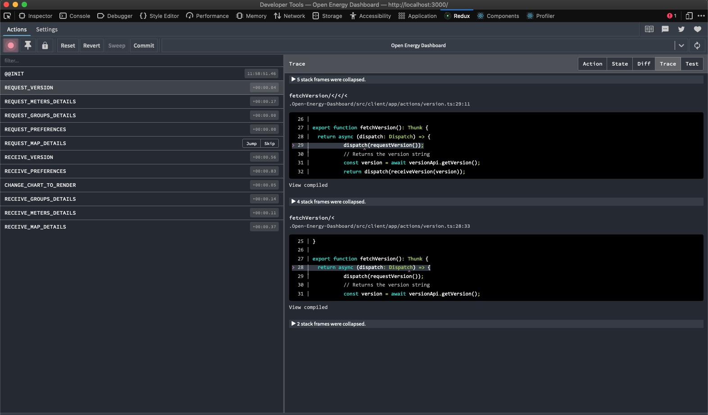

- This shows the dispatch of requestVersion() in src/client/app/actions/version.ts on line 29.
- Clicking RECEIVE_VERSION shows it happens on on 32 of the same file. Between the two is `const version = await versionApi.getVersion();` that routes to the server to get the version.
- Click back on REQUEST_VERSION and the Diff tab. It shows that version->isFetching went from false to true. Click on State tab to see the version state in the full state where also shows that version is currently "" (empty). If you click on RECEIVE_VERSION you can see it sets the isFetching to false and version to 'v0.8.0' (or the current version of OED).

3. Now look at it in the debugger with running code. Click the Debugger tab in Firefox. In Firefox work from Main Thread->Webpack.

    - In Chrome use Sources tab. Probably need to Add folder to Workspace where you just use the main OED directory and work from that.
    - Something is wrong in the setup for Chrome - [https://docs.microsoft.com/en-us/visualstudio/javascript/debug-nodejs?view=vs-2019#generate_source_maps](https://docs.microsoft.com/en-us/visualstudio/javascript/debug-nodejs?view=vs-2019#generate_source_maps) might help.??
    - Check if turning on redux trace caused the issue with Chrome??

- From analysis above, we should start in src/client/app/index.tsx. Put a breakpoint right after store creation where it dispatches initScript. Do at start of line but can put the breakpoint at subparts of the line of code. Reload page in web browser. It stops but not much information since at start of process.

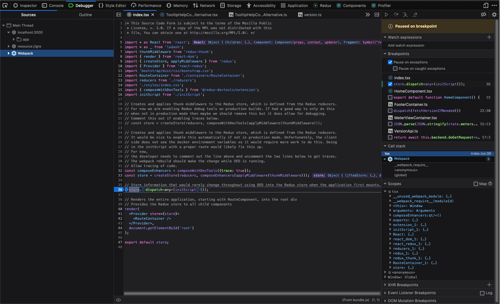

If you step into then you go to initScript. You can continue to do this but you wind up in a lot of other code and then in non-OED code. Hit the resume for the debugger to continue execution and the page will load. Now disable this breakpoint.

- Now try from the last version code the client executes in src/client/app/utils/api/VersionApi.ts. Put a breakpoint at start of line for return await this.backend.doGetRequest\<string\>('/api/version');. Reload page and when it gets to this breakpoint, look at stack. Click to expand rows.

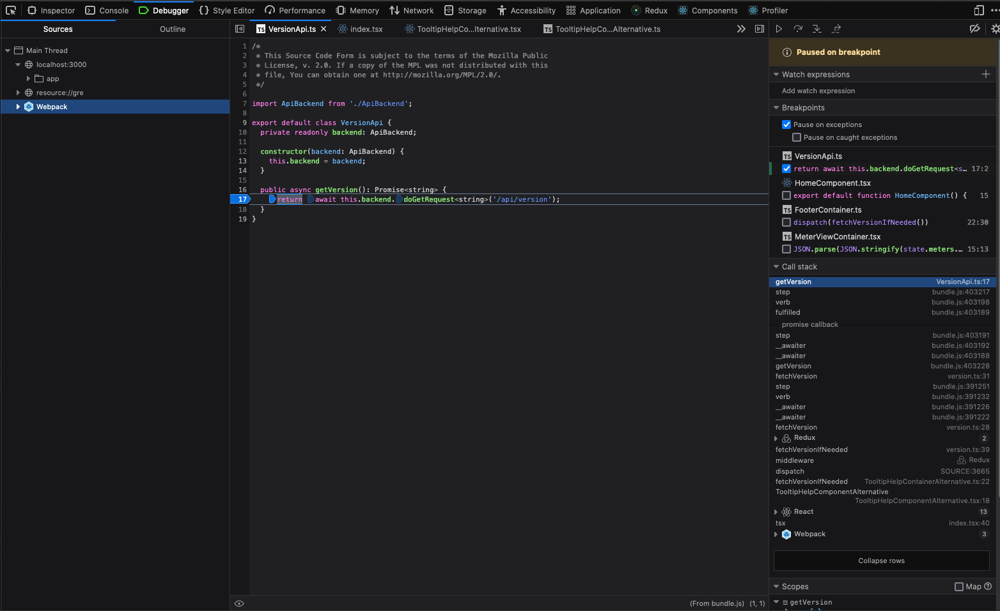

- At the top is VersionApi.tx:17 which seems fine and some others below that are not OED code.
- The next interesting one is fetchVersion at version.ts:31. Click on it to go to src/client/app/actions/version.ts and this is the line that calls versionApi.getVersion().
- The next one is fetchVersion at version.ts:28 which is start of the function.
- The next one is fetchVersionIfNeeded at version.ts:39. This is the dispatch of fetchVersion inside of fetchVersionIfNeeded().
- Next is fetchVersionIfNeeded in src/client/app/containers/TooltipHelpContainerAlternative.ts:22 that dispatches fetchVersionIfNeeded.
- Next is constructor in src/client/app/components/TooltipHelpComponentAlternative.tsx:18 that has this.props.fetchVersionIfNeeded();. This is because the Tooltip needs to know the version to give the correct link to the help webpages.
- If continue execution then the web page loads. I don't know why but you often need to click continue in the web browser window and not the debugger window. ?? Why don't we see the calls from FooterContainer??
- Now put breakpoint in src/client/app/containers/FooterContainer.ts:22 where does fetchVersionIfNeeded. Refresh and it stops there. The stack shows it came from FooterComponent.tsx:19 (in constructor) but not other OED code. Continue execution and see same stack as last one when stops in versionAPI. ??I can only assume this happens since it does not need to fetchVersion multiple times but not certain.??
- To try another step back according to the code analysis above, put breakpoint in src/client/app/components/HomeComponent.tsx:15 where it does export default function HomeComponent(). Stops as expected. When continues stops in FooterContainer.ts and then versionAPI.
