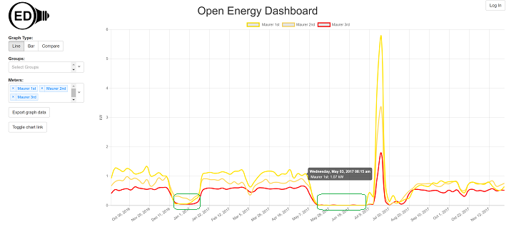
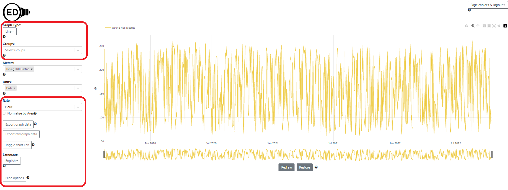
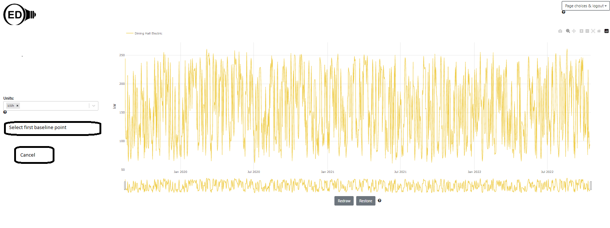
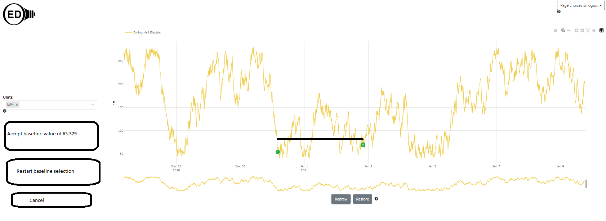

# Baseline

## Introduction

Meters show non-zero value even when someone is not in a building. This is due to systems in the building, such as fans, that are not under the control of building occupants. The value of this reading is known as the baseline usage (or just baseline). The low troughs in this OED graphic represent potential baseline dates when students are not in residence and are indicated with green rectangles (this is an image of an older version of OED):

When users look at usage they currently see the total usage including the baseline. This can confuse people because the usage may be much higher than they expect due to the baseline usage. Furthermore, when sustainability people ask for building occupants to reduce consumption, they often use OED to show the outcome. This can disappoint people because the percentage change is much lower due to inclusion of the baseline usage. To mitigate the impact of baseline usage, we want the option to subtract the baseline from the data shown to the user. OED will still allow the current graphic because energy managers and others want to see total usage because that represents the actual usage.

OED includes database entries for storing baseline information but it has never been used. OED wants to have a system for semiautomatic baselining of meters. This will allow an admin to choose the start and end time of low usage via mouse click on a graph and OED will automatically calculate and allow the admin to store the optimal baseline. This requires a calculation because the energy usage varies a little over time and is not constant during the baseline period. With these two piece in place, OED will be ready to add the option to subtract baseline values from the graphics displayed.

The very old [issue #209](https://github.com/OpenEnergyDashboard/OED/issues/209) covers baselining meters and [issue #210](https://github.com/OpenEnergyDashboard/OED/issues/210) addresses adding it to graphics. Note that access to cik in client Redux state assumes (at least part of) [issue #901](https://github.com/OpenEnergyDashboard/OED/issues/901) is complete. This is a non-trivial change to OED so the work can be split among teams and a team might only do part of the work for others to do more later.

## Implementation

As a first shot, baselines will not vary with time. However, OED wants to allow this once that is figured out. See [conversionsVaryTime.md](../unitVaryTime/conversionsVaryTime.md) for the design of that feature.

### Database changes

1. The database table "baseline" will be removed. There should be no values in this table so simply deleting in the migration should be safe. The new design does not use this table.
2. To parallel area, the baseline value will be stored in the meters and groups tables. Each table will have the following new attributes/columns:

- baseline_value FLOAT (double precision) to hold the baseline value with default value of 0 and NOT NULL.
- baseline_unit_id INT is a foreign key into the unit table for the unit id. It has a default value of no unit (null).
- baseline_note TEXT is an OED string about the baseline with a default of an empty string.

### Setting baseline of meters

The meter create and edit pages will have items to allow the admin to set the baseline. Most have parallels to the area setting code.

- A new number entry field to allow the admin to set the baseline of a meter to any value of 0 or greater where 0 indicates no baseline. On the create page the value will be set to 0 on starting the page. When this value is set by the admin, "Baseline note" is changed to "Baseline set manually" if the value is greater than 0 and the empty string if it is zero. Note all non-empty strings should be internationalized.
- A new dropdown menu will allow the admin to set the unit associated with the baseline. The default value is "no unit" on meter creation and the allowed values are the same as the "Default Graphic Unit" menu choices. It must be set if the baseline value > 0 on saving. When this value is set by the admin, "Baseline note" is changed to "Baseline set manually" if the value is greater than 0 and the empty string if it is zero. It would be nice to warn the admin that they probably want to change the baseline value when the unit is changed.
- The baseline note is displayed but cannot be changed. For create it starts as an empty string.
- The meter edit page will have a button below these fields with "Graphically Set Baseline". This is similar to the group page with the "Calculate Group Area" button. It is limited to edit because a new meter does not have any reading data to do the needed calculations. Clicking this button will begin the following process that can set the values in the other three baseline fields:

1. The admin is taken to a separate page or modal that will look very similar to the line graphic page as show here:

This page is for admins only. In this figure, the items in red boxes are excluded. The hope is that most of the elements can be shared with the line graphic page to minimize code duplication. The meter will be set to the one being edited. The initial "Units" selection will be the usual default graphic unit for the page and the rate will always be the default of Hour. A new "Cancel" button will be at the bottom of the choices on the left and it stops the process at any point and returns to the meter edit page without updating the values (see below under accept for more info). Note the admin can use the "Units" menu to change the displayed unit at any time. Logic already available should update the graph values. Whenever this is done the process restarts so this is the same as clicking "Restart baseline selection" as described below.
2. The admin will determine the time range desired for the baseline. This will probably involve looking at the meter line graphic and using the zoom/redraw features to determine where the baseline exists. This is already part of OED and not part of this effort.
3. The admin will select two points on the graph. Each point represents a x-axis value or date/time. As such, the click does not have to occur on the line. When the page first appears, it will have a new button "Select first baseline point" as in this figure:

The exact look and placement of the buttons may be different but this is the basic idea. It also shows the cancel button. The admin can now click on the graph. With each click, a circle will be added to the graphic to indicate the location. If another click is made then the previous circle is removed and the new location circle created. This continues until the admin clicks the "Select first baseline point" button. After that is clicked, a few things happen:

- The look of the selected point is changed so it is indicated on the graphic but different from the previous look. The exact look is open and will depend on what can easily be done in Plotly. For example, it might go from black to green fill.
- The button changes to "Select second baseline point".
- A new button appears that says "Restart baseline selection". Whenever this button is clicked, you reset the baseline process. This means all values selected are removed and only the original "Select first baseline point" button is shown. The "Unit" is not changed.

4. The admin now selects the second baseline point. This is basically the same as the first point. Once they click the button the following happens:

- The order of the selected points does not matter and the code should work whether the first point is first or second in date/time.
- OED calculates the average reading over the time range of the two points. This is logically a single bar value over the time range divided by the time range. Another way to think about it is as being similar to the reading rate views but with one point for the entire time range. The current code is in src/server/sql/reading/create_reading_views.sql. A fast way to calculate this value is:
  - Round the time range to full days so the earlier point is rounded up to the start of the next day and the later point is round down to the end of the previous day (which may be the start of the next day).
  - Use a variant of the bar code where you get a single bar across all these days. This will basically use the daily reading table to get the correct sum of the daily readings. This needs to be converted to a rate if that is not done directly.
  - Now add in the time lost (if any) on the two ends for the partial days. This could be done first with full hours from the hourly table and then the missing parts not in full hours. However, this is not commonly done so it is fine to use the raw table to get these values as in a similar way to the raw line readings.
  - Note that the current functions take care of missing time and these versions need to do the same.
  - Anyone needing help with this calculation should ask for it as this isn't too hard but it is a little complex.
- Place a horizontal line on the Plotly graphic where the y-axis value is the average reading just calculated and the x-axis limits are the time range selected. The hope is to leave the admin selected points from before so they need to be a size that does not obscure the line.
- The "Select second baseline point" is replaced with a button that says "Accept baseline value of XXXXXX" where XXXXX is the y-axis value shown on the graphic. Overall the page might look as follows:

Note that the user selected points do not need to lie on the line as they are at the y-axis value where they clicked. The line should clearly be distinguishable from any graphic line so thicker.

5. If the admin clicks the accept button then the admin returns to the meter edit page where the fields for baseline value and unit are set to the ones determined. The value of the baseline note is set to "Baseline set automatically from \<first date admin selected\> to \<second date admin selected\>". How easy it is to return to the modal is unclear. If there are issues then changes will need to be made in how to get to this graphic page to set baselines. Note the new baseline values are not put into the database until the admin saves on the meter modal page.

### Setting baseline of groups

Groups are a collection of meters. As such, the baseline is, in principle, the sum the the baselines of the included meters. The complication is that some included meters may not have a baseline value. The normalization by area has similar considerations and will be used as the example of what to do here. The group create and edit pages will have new fields for baseline as meters and a button to calculate the baseline. This button will work similarly to what area does so it will sum the baselines of all included meters and warn the admin of any that do not have baselines with the same options to either accept or reject the value. Note that if meters have baseline in a unit that differs from the currently selected unit then they need to be converted as discussed below for graphing. Thus, a group can set a baseline in three ways:

1. manually as with a meter
2. calculated from the underlying meters (similarly to area)
3. graphically as with a meter where the page that pops up is similar to the meter one but showing the group instead

The choices should show up in this order on the page.

### Baseline and graphics

Each graphic page will have a checkbox to subtract the baseline. It will work similarly to the area normalization button. Thus, meters/groups that cannot be normalized will be hidden and the checkbox will be hidden for raw units. Also, meters/groups will not be shown if there is no baseline (value of zero).

Until OED allows baselines to vary with time, the baseline code will do what is done with area where the new graphic values are calculated on the client side. The difference is baselines are subtracted and area is divided. This will mean the Redux state for meters/groups will need to include the baseline value for access.

A few notes on the graphical values:

- If the unit that is being graphed does not equal the baseline unit then the value of the baseline needs to be converted. This will involve the Redux state that holds the conversions named cik. The value to shift is equal to:
  - invertConversion is a function that inverts a conversion. See src/server/services/graph/pathConversion.js for how done on server now.
  - updatedConversion combines conversions. See the same file as the previous point.
  - baseline shift = baseline_value x updatedConversion(invertConversion(c\[meter id\]\[baseline unit\]), c\[meter_id\]\[graphic unit\]) where the values passed are the slope and intercept so do not exactly match the functions. The x means to apply the given conversion which is value * slope + intercept. This formula inverts the conversion from the baseline unit to the meter unit, then converts from the meter unit to the graphic unit and then converts the baseline value from the baseline unit to the graphic unit using that overall conversion.
- In all cases you need to do the baseline shift before normalizing by area.
- bar, compare and map show quantities and OED is storing baselines as rates. The shifted value is thus the rate * time interval.
- The compare value % change is for the baselined value if that is being done.

### Admin setting of default behavior

Similarly to area, the admin page will allow setting subtraction of baseline as the default. This will require changes to the route and a new database column.

### Error estimate on baseline

When the admin sets the baseline graphically, OED could estimate the error. The error would give an idea of how much the actual data deviates from the calculated baseline. The value used is up for discussion but it might be the standard deviation or some other statical measure. This would be shown to the admin after the second point is entered and before the save happens. This is a nice feature but it is not essential so it may be done later if needed.
