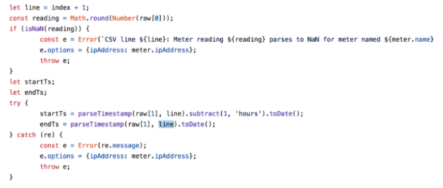

**Current input:**

1. Metasys Data

* **readCSV** parses the csv file to an array of array _without_ checking its size, format, nor the values within it
* **readMetasysData** calls **readCSV**, then converts the returned array to type Reading (which includes meter.id, meterReading, startTimestamp.toDate(), endTimestamp.toDate()). Those values, then, are inserted to the Reading class.

2. CSV stream

* **loadFromCsvStream** maps each row of the stream to a returned model (only check if they’re null or not) as Reading values
* **loadMamacReadingsFromCsvFile** calls **loadFromCsvStream, **then inserts the returned values to the Reading class.

3. MAMAC data

* **readMamacData** takes in a meter, check if its IP address and ID are valid, then calls readCSV to read the file associated to meter’s IP address and return Reading values
* **updateMeters** calls readMamacData on a set of meters, then inserts the returned values to the Reading class.

**Suggestions**:

* My observation is that we already have a standardized data type (Reading). **readMetasysData**, **loadFromCsvStream**, and **readMamacData** are all doing their jobs to convert information from csv files to this type. Please let me know if you want something different from this.
* However, I notice that all of the above functions are reading from different csv files and assuming specific columns to contain certain information. For example (this is from readMamacData):

Here, raw[0] is assumed to contain the reading value while raw[1] is assumed to contain ending time. This may not be the case for a different formats (what if we have a column for the meter’s name?). Can this be a problem when we want to expand our project? If yes, I think we can let the user to give some simple, one-time instructions about the data file that can be passed in as a function. 

* Beside that, if we know exactly the format of the file, maybe we can go one step further to merge all the functions above into a single one (considering they have the same input and output right now). That function simply gets important information from csv file - meter id, reading value, starting time, and ending time - then converts them to Reading type.
* I know they’re ambitious suggestions... So here are some smaller ones (pretty much a sum-up from our last discussion):

  * Check for file’s size in readCSV
  * Check for anomalous value in any input type (currently I only added that to updateMeters)
  * Check for unusual date

=> Those tests are pretty general, so I think they’ll go well with the idea of a “pipe” of Reading values.

[A diagram of the function design](HaFunctionDesign.png)
